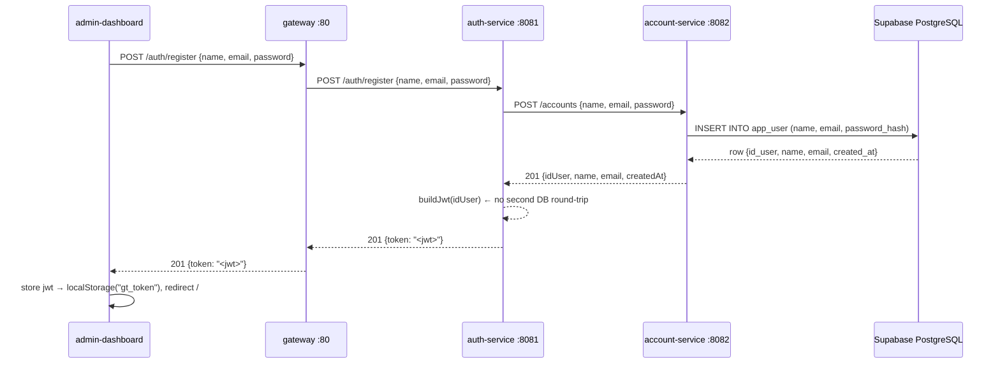
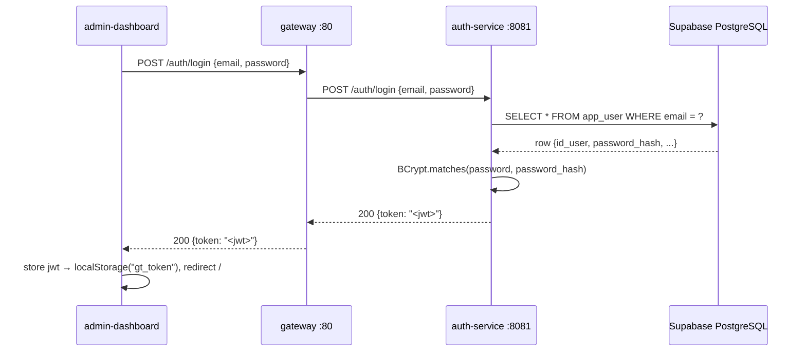
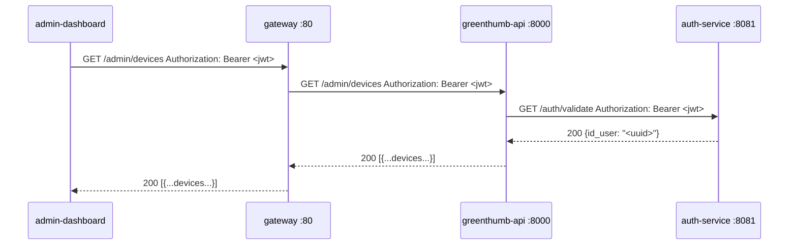

# Authentication & User Management — Architecture & Flow

## 1. Architecture Overview

The auth/account system is split across two Java microservices that follow the
**complementary library + service wrapper** pattern from the `hbrn-fastapi-template`
organisation:

| Service | Port | Responsibility |
|---|---|---|
| **auth-service** | 8081 | Issues and validates JWTs; delegates registration to account-service |
| **account-service** | 8082 | Full CRUD on `app_user`; hashes passwords with BCrypt |

The **gateway** (port 80) is the single public entry point. It routes traffic
by path prefix — clients never address auth-service or account-service directly.

```
Client → Gateway :80
          ├── /auth/**      → auth-service    :8081
          ├── /accounts/**  → account-service :8082
          └── /admin/**     → greenthumb-api  :8000
```

**Why two services?** auth-service owns the JWT lifecycle and BCrypt
_verification_ (login). account-service owns the user record and BCrypt
_creation_ (registration). greenthumb-api (Python) never touches passwords —
it only sees `id_user`, `name`, `email`, `created_at`.

---

## 2. Registration Flow



**Key points:**
- account-service hashes the password with BCrypt before writing to the DB.
- auth-service never stores the plain password; it receives only the `idUser` from account-service and uses it as the JWT subject.
- On conflict (duplicate email) account-service returns 409; auth-service propagates it.

---

## 3. Login Flow



**Key points:**
- auth-service queries `app_user` directly via JPA for login — no round-trip to account-service.
- On bad credentials (wrong email or wrong password) auth-service returns 401.
- JWT subject is the `id_user` UUID string. Expiry: 24 hours.

---

## 4. Token Validation Flow

greenthumb-api (Python FastAPI) validates tokens on every admin request:



**Key points:**
- greenthumb-api's `get_current_user_id` dependency calls `GET /auth/validate` on every protected route.
- auth-service parses the JWT signature and returns the `id_user` claim.
- greenthumb-api uses `id_user` only for scoping queries — it never reads `password_hash`.

---

## 5. Database Schema

The `app_user` table in Supabase is the single source of truth for user records.

```sql
CREATE TABLE app_user (
    id_user       UUID        PRIMARY KEY DEFAULT gen_random_uuid(),
    name          VARCHAR     NOT NULL,
    email         VARCHAR     NOT NULL UNIQUE,
    password_hash VARCHAR     NOT NULL,
    created_at    TIMESTAMP   NOT NULL DEFAULT CURRENT_TIMESTAMP
);
```

Column visibility by service:

| Column | auth-service | account-service | greenthumb-api (Python) |
|---|---|---|---|
| `id_user` | read | read/write | read |
| `name` | read | read/write | read |
| `email` | read | read/write | read |
| `password_hash` | read (BCrypt verify) | write (BCrypt hash) | **never accessed** |
| `created_at` | read | read/write | read |

The Pi (`rasp5/`) caches a read-only copy of `app_user` (without `password_hash`)
so the `device.id_user` FK remains valid locally. The Pi never writes to this
table.

**Migration command** (run in Supabase SQL Editor after deploying):

```sql
ALTER TABLE app_user ADD COLUMN IF NOT EXISTS password_hash VARCHAR NOT NULL DEFAULT '';
-- After backfilling hashes for any existing rows, drop the default:
ALTER TABLE app_user ALTER COLUMN password_hash DROP DEFAULT;
```

---

## 6. API Reference

### `POST /auth/register`

Creates a new user account and returns a JWT.

**Request**
```json
{ "name": "Alice", "email": "alice@example.com", "password": "secret123" }
```

**Response — 201 Created**
```json
{ "token": "<jwt>" }
```

**Error responses**
| Status | Condition |
|---|---|
| 409 Conflict | Email already registered |
| 502 Bad Gateway | account-service unreachable |

---

### `POST /auth/login`

Authenticates an existing user and returns a JWT.

**Request**
```json
{ "email": "alice@example.com", "password": "secret123" }
```

**Response — 200 OK**
```json
{ "token": "<jwt>" }
```

**Error responses**
| Status | Condition |
|---|---|
| 401 Unauthorized | Email not found or wrong password |

---

### `GET /auth/validate`

Validates a JWT (service-to-service; called by greenthumb-api).

**Request headers**
```
Authorization: Bearer <jwt>
```

**Response — 200 OK**
```json
{ "id_user": "550e8400-e29b-41d4-a716-446655440000" }
```

**Error responses**
| Status | Condition |
|---|---|
| 401 Unauthorized | Token invalid, expired, or malformed |

---

### `POST /accounts`

Creates a user record directly in account-service (called internally by auth-service during registration).

**Request**
```json
{ "name": "Alice", "email": "alice@example.com", "password": "secret123" }
```

**Response — 201 Created**
```json
{
  "idUser": "550e8400-e29b-41d4-a716-446655440000",
  "name": "Alice",
  "email": "alice@example.com",
  "createdAt": "2026-05-05T12:00:00"
}
```

**Error responses**
| Status | Condition |
|---|---|
| 409 Conflict | Email already registered |

---

### `GET /accounts/{id}`

Returns public account details by UUID.

**Response — 200 OK**
```json
{
  "idUser": "550e8400-e29b-41d4-a716-446655440000",
  "name": "Alice",
  "email": "alice@example.com",
  "createdAt": "2026-05-05T12:00:00"
}
```

**Error responses**
| Status | Condition |
|---|---|
| 404 Not Found | No user with that UUID |

---

### `PATCH /accounts/{id}`

Partially updates `name` and/or `email`.

**Request** (all fields optional)
```json
{ "name": "Alice Smith", "email": "alice.smith@example.com" }
```

**Response — 200 OK** — updated `AccountOut` (same shape as GET).

---

### `DELETE /accounts/{id}`

Deletes a user record.

**Response — 204 No Content**

**Error responses**
| Status | Condition |
|---|---|
| 404 Not Found | No user with that UUID |

---

## 7. Environment Variables

### auth-service

| Variable | Required | Description |
|---|---|---|
| `DB_URL` | yes | Supabase JDBC URL, e.g. `jdbc:postgresql://...` |
| `DB_USER` | yes | Supabase database user |
| `DB_PASSWORD` | yes | Supabase database password |
| `JWT_SECRET` | yes | HS256 signing key (min 32 chars) |
| `ACCOUNT_SERVICE_URL` | no | Defaults to `http://account-service:8082` |

### account-service

| Variable | Required | Description |
|---|---|---|
| `DB_URL` | yes | Same Supabase JDBC URL |
| `DB_USER` | yes | Same Supabase database user |
| `DB_PASSWORD` | yes | Same Supabase database password |

---

## 8. Dev Auth Bypass

greenthumb-api supports `DEV_AUTH_BYPASS=true` to skip JWT validation in local
development. When enabled, `get_current_user_id` returns a hardcoded stub UUID
instead of calling `GET /auth/validate`. This lets you test admin routes without
a running auth-service.

**Set in `.env`:**
```
DEV_AUTH_BYPASS=true
```

**Do not enable in production.** The compose.yaml defaults to `false`:
```yaml
DEV_AUTH_BYPASS: ${DEV_AUTH_BYPASS:-false}
```
